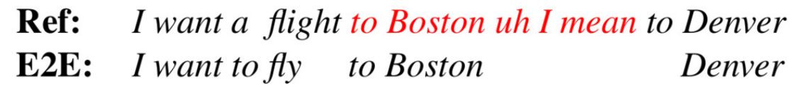
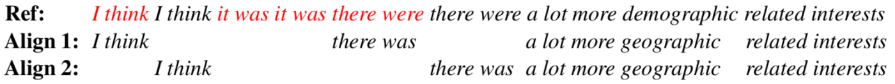

## E2E Speech Recognition and Disfluency Removal Evaluation

Evaluation code for joint ASR and disfluency removal based on [End-to-End Speech Recognition and Disfluency Removal](https://arxiv.org/pdf/2009.10298.pdf) from EMNLP 2020.

### Abstract

Disfluency detection is usually an intermediate step between an automatic speech recognition (ASR) system and a downstream task (e.g. machine translation). By contrast, this paper aims to investigate the task of end-to-end speech recognition and disfluency removal. We specifically explore whether it is possible to train an ASR model to directly map disfluent speech into fluent transcripts, without relying on a separate disfluency detection model. We show that end-to-end models do learn to directly generate fluent transcripts; however, their performance is slightly worse than a baseline pipeline approach consisting of an ASR system and a disfluency detection model. We also propose two new metrics that can be used for evaluating integrated ASR and disfluency models. 

### Word Error Rate (WER)

Word Error Rate (WER) is a standard metric for evaluating ASR models; however, it is insufficient for evaluating outputs of end-to-end ASR and disfluency removal systems as it fails to measure the fluency of generated transcript. Consider the following example! *Ref* is the reference transcript which is human-transcribed speech with gold disfluency labels, shown in red. *E2E* represents the output of an end-to-end ASR and disfluency removal model. 
 
 <p align="center">
  
</p> 

An ideal hypothesis is expected to contain all fluent words and discard all disfluencies (red words). Since the reference transcript contains both fluent and disfluent words, a WER of zero on the full transcript means that the system returned all of the disfluent words as well as the fluent words, which is not what an integrated system should do. This repo contains the code for calculating two new metrics called Fluent Error Rate (FER) and Disfluent Error Rate (DER) which are used to assess ASR outputs in terms of fluency and word recognition performance. 

### Fluent Error Rate (FER) and Disfluent Error Rate (DER) 

To overcome the limitations of WER, we use the standard WER evaluation to evaluate fluent and disfluent words separately. In this way, the quality of end-to-end model outputs is evaluated in terms of both fluency and word recognition. We calculate the word error rate on fluent words (which we call the fluent error rate or FER) as the number of substitutions, deletions and insertions among fluent words divided by the total number of fluent words in the reference transcript. We define the word error rate on disfluent words (which we call the disfluent error rate or DER) as anything other than a deletion (i.e. substitutions, insertions and copies) among disfluent words divided by the total number of disfluent words in the reference transcript. We calculate FER and DER using a modified ASR alginment algorithm which uses two slightly different sets of cost for aligning fluent and disfluent regions. Since many disfluencies are copies (e.g. *The the the student is here*), if the same cost is used to align fluent and disfluent words, the alignment will be ambiguous (i.e. there will be multiple alignments with the same cost). On the other hand, we expect an aligner to match ASR words to the fluent words in the reference and align null (i.e. deletions) with the disfluent ones in the reference. Therefore, a standard ASR alignment algorithm can lead to undesirable alignments in end-to-end ASR and disfluency removal models. As a solution, we suggest to use two slightly different sets of cost for aligning fluent and disfluent regions such that the aligner would bias away from selecting disfluent words. The new evaluation metrics and alignment weights are useful for aligning and evaluating any end-to-end systems trained to remove disfluency in the output, e.g. end-to-end machine translation and disfluency removal.
 
 <center>
 Operation | Fluent | Disfluent
 --- | --- | ---
 copy | 0 | 0 + 1e-7
 deletion | 3 | 3 - 1e-7
 insertion | 3 | 3 + 1e-7
 substitution | 4 | 4 + 1e-7   
<\center>
 
Consider the following example! *Align 1* represents the alignment between the output of an integrated ASR and disfluency model and the reference transcript generated by the standard alignment costs where equal costs are allocated for aligning fluent and disfluent words (copy=0, deletion=3, insertion=3 and substitution=4). *Align 2* is the desired alignment in order to make meaningful FER and DER evaluations which is achieved by using two different sets of cost for aligining fluent and disfluent words.
 
 <p align="center">
  
</p>

### Requirement 

- Python 3.6 or higher (should work with python 2 as well)

### Align and Score

The format of files passed to `--ref` and `--hyp` should be one sentence per line. All words in the reference and hypothesis files are lowercase, except for gold disfluent words in reference which are all capital letters. Check *ref* and *hyp* arrays in `aligner.py` to see the expected format.

To align the reference and hypothesis transcripts and calculate WER using a standard ASR alginment algorithm:
```
$ python3 main.py --ref /path/to/reference/file --hyp /path/to/hypothesis/file --mode s_align --result-path /to/save/aligments/and/scores
```
To align the reference and hypothesis transcripts and calculate FER and DER using the modified ASR alginment algorithm:
```
$ python3 main.py --ref /path/to/reference/file --hyp /path/to/hypothesis/file --mode m_align --result-path /to/save/aligments/and/scores
```

To test the modified algorithm using the pre-defined reference and hypothesis sentences:

```
$ python3 main.py --mode test
```

### Citation

If you use the code, please cite the following paper:
```
@inproceedings{jamshid-lou-2020-end-to-end,
    title = "End-to-End Speech Recognition and Disfluency Removal",
    author = "Jamshid Lou, Paria and Johnson, Mark",
    booktitle = "arxiv",
    year = "2020",
    url = "https://arxiv.org/pdf/2009.10298.pdf"
}
```

### Contact

Paria Jamshid Lou <paria.jamshid-lou@hdr.mq.edu.au>
